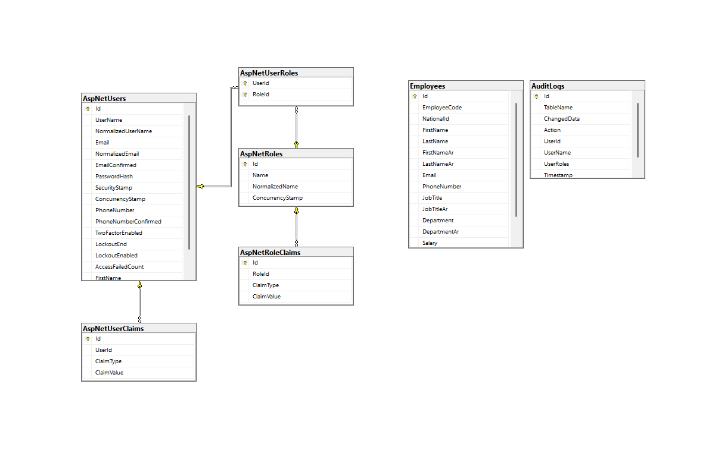

# EmployeeManagementSystemLoginHr


## Overview
EmployeeManagementSystemLoginHr is a .NET 8-based application designed to manage employee information, user roles, and permissions. It includes features such as JWT authentication, role-based authorization, and audit logging.

## Features
- JWT Authentication for securing APIs
- Role-Based Authorization (Admin/User roles)
- Policy-based authorization for admin endpoints
- CRUD operations for employees
- User management and role assignment
- Audit logging for tracking changes
- FluentValidation for input validation
- Swagger documentation for API endpoints


## Prerequisites
- .NET 8 SDK
- SQL Server
- Visual Studio 2022 or later

## Getting Started

### Clone the Repository

```shell
git clone https://github.com/shazlee00/EmployeeManagementSystemLoginHr.git
cd EmployeeManagementSystemLoginHr

```

### Configure the Database
1. Update the connection string in `appsettings.json`:
    
```json
    "ConnectionStrings": {
        "Default": "Server=your_server;Database=your_database;User Id=your_user;Password=your_password;"
    }
    
```

2. Apply migrations to create the database schema:
    
```shell
    dotnet ef database update
    
```

### Run the Application
1. Build and run the application:
    
```shell
    dotnet run
    
```

2. Open your browser and navigate to `https://localhost:5001/swagger` to access the Swagger UI.

## Project Structure
- **Controllers**: API controllers for handling HTTP requests.
- **Dtos**: Data Transfer Objects for input and output models.
- **Models**: Entity models representing the database schema.
- **Services**: Business logic and service layer.
- **UOW**: Unit of Work pattern implementation.
- **Context**: Database context and audit interceptor.

## Authentication & Authorization
### JWT Authentication
- Configure JWT settings in `appsettings.json`:
    
```json
    "Jwt": {
        "Key": "YourSecretKey",
        "Issuer": "YourIssuer",
        "Audience": "YourAudience",
        "ExpireMinutes": 60
    }
    
```

### Role-Based Authorization
- Define roles in your application:
    
```csharp
    public static class Roles
    {
        public const string Admin = "Admin";
        public const string User = "User";
    }
    
```

- Assign roles to users during registration or through an admin interface.

### Policy-Based Authorization
- Create authorization policies in `Program.cs`:
    
```csharp
    builder.Services.AddAuthorization(options =>
    {
        options.AddPolicy("RequireAdminRole", policy => policy.RequireRole(Roles.Admin));
    });
    
```

## Database ERD Design

The following diagram represents the database structure for the Employee Management System:




## Audit Logging
- The `AuditInterceptor` class tracks changes to entities and logs them in the `AuditLog` table.

## API Documentation
- Swagger is configured to provide API documentation. Access it at `https://localhost:5001/swagger`.


## Contact
For any questions or issues, please contact melshazly@gmail.com.
